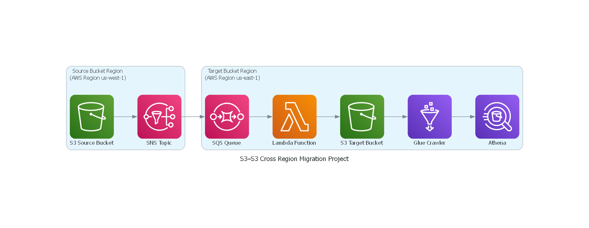

# 🧭 AWS Cross-Region S3 to S3 Migration Using Lambda

This project demonstrates a serverless data pipeline using **AWS S3**, **SNS**, **SQS**, **Lambda**, **Glue**, and **Athena** to automatically transfer a file from a source-region S3 bucket to a target-region S3 bucket. Once transferred, the file is cataloged using AWS Glue and queried using Athena.

---

## 🧩 Architecture Overview


1. **Source S3 Bucket (us-east-1)**  
   - Accepts uploads of raw files
   - Triggers an event notification

2. **SNS Topic**  
   - Broadcasts new object notifications to subscribers

3. **SQS Queue**  
   - Subscribes to SNS topic
   - Triggers the Lambda function

4. **AWS Lambda**  
   - Processes SQS events
   - Copies file to the target-region S3 bucket
   - Sends notification or triggers Glue crawler

5. **Target S3 Bucket (default region)**  
   - Stores the transferred data file

6. **Glue Crawler**  
   - Scans the bucket and creates a table in Glue Catalog

7. **Athena**  
   - Queries the structured data via SQL using Glue catalog metadata

---

## 🔧 Tech Stack

- **Amazon S3** – Cross-region object storage
- **Amazon SNS** – Publish new file notifications
- **Amazon SQS** – Queue to decouple SNS from Lambda
- **AWS Lambda** – Executes file copy and triggers crawler
- **AWS Glue** – Crawls and catalogs target bucket
- **Amazon Athena** – Runs queries against S3 data using the catalog

---

## 📂 Repository Structure

```
aws-cross-region-s3-migration/
│
├── README.md                         → Project overview, architecture, and setup instructions
├── diagrams/
│   └── architecture.png              → Visual diagram illustrating the event-driven migration pipeline
│
├── lambda/
│   └── migrate_file_lambda.py        → Python script for AWS Lambda that copies S3 files and triggers Glue
│
├── sample-data/
│   └── customer.csv                 → Sample input file used for testing the data pipeline
```

---

## ▶️ How It Works

1. ☁️ Upload a file (e.g., `customer.csv`) to the **source S3 bucket**  
   (via AWS Console, CLI, or automation)

2. 📣 The file triggers an **SNS topic**, which sends a message to an **SQS queue**.

3. ⚙️ **Lambda** polls the queue, copies the file to the **target-region S3 bucket**, and optionally notifies the Glue Crawler.

4. 🧬 **Glue Crawler** scans the new data and updates the Glue Data Catalog.

5. 🔎 **Athena** uses the Glue catalog to run SQL queries over the S3 data.

---

## ✅ Highlights

- Cross-region S3 object migration
- Event-driven, serverless data pipeline
- Automated metadata cataloging and querying
- Integration of five core AWS services: S3, SNS, SQS, Lambda, Glue, Athena

---

## 🏷️ Tags & Topics
```
#AWS #S3 #Lambda #SNS #SQS #Glue #Athena #Serverless #DataPipeline #CloudEngineering #CrossRegion
```

---
